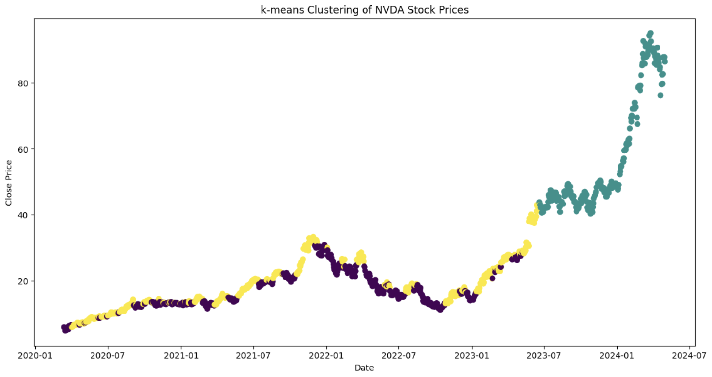

# **Stock Price Prediction using K-Means Clustering**

## **Overview**
This project applies **K-Means Clustering** to analyze and predict stock prices, specifically focusing on **NVIDIA (NVDA) stock**. The goal is to identify different market phases (e.g., accumulation, volatility, bullish trends) based on technical indicators such as:

- **Simple Moving Average (SMA_20, SMA_50)**
- **Relative Strength Index (RSI)**
- **Stock Closing Prices**

The project also includes **data preprocessing, clustering analysis, and visualization** to gain insights into stock price trends.

## **Project Features**
- **Data Collection**: Retrieves historical stock price data.
- **Feature Engineering**: Computes technical indicators like **SMA** and **RSI**.
- **K-Means Clustering**: Groups stock price trends into clusters.
- **Visualization**: Generates scatter plots to interpret cluster behavior.
- **Analysis of Trends**: Explains how different clusters correspond to market trends.

## **Installation**
To run this project, ensure you have **Python 3.x** installed along with the required dependencies.

1. Clone this repository:
   ```bash
   git clone https://github.com/your-username/your-repo-name.git
   cd your-repo-name
   ```

2. Install dependencies:
   ```bash
   pip install -r requirements.txt
   ```

## **Usage**
Run the Jupyter Notebook to execute the stock price clustering analysis:

```bash
jupyter notebook Final_Project.ipynb
```

Or run the Python script (if applicable):
```bash
python main.py
```

## **Data Preprocessing**
The dataset is preprocessed by:
- Handling missing values
- Normalizing stock price data
- Computing technical indicators (SMA, RSI)
- Preparing data for clustering

## **Clustering Analysis**
The **K-Means clustering algorithm** is used to group the stock prices based on different market conditions. The results are visualized in scatter plots, which illustrate how stock prices evolve over time.

### **Key Observations**
- **Purple Cluster**: Represents earlier stock prices (2020-2023), indicating a stable accumulation phase.
- **Teal Cluster**: Appears during periods of **moderate fluctuations**.
- **Yellow Cluster**: Represents the later stages (2023-2024), marking a **bullish trend**.

## **Visualization**
Generated plots help understand how stock prices **transition over time** through different market phases.

Example visualization:
 

## **Technologies Used**
- **Python**
- **Jupyter Notebook**
- **Pandas, NumPy** (Data Manipulation)
- **Matplotlib, Seaborn** (Visualization)
- **Scikit-learn** (K-Means Clustering)
- **yfinance** (Fetching Stock Data)

## **Future Improvements**
- Implementing **LSTM models** for predictive analytics.
- Adding **sentiment analysis** from financial news.
- Enhancing feature selection for improved clustering results.

## **Contributors**
- **Shivam Jain** - *Lead Developer & Researcher*

## **License**
This project is licensed under the **MIT License** - see the [LICENSE](LICENSE) file for details.

---

